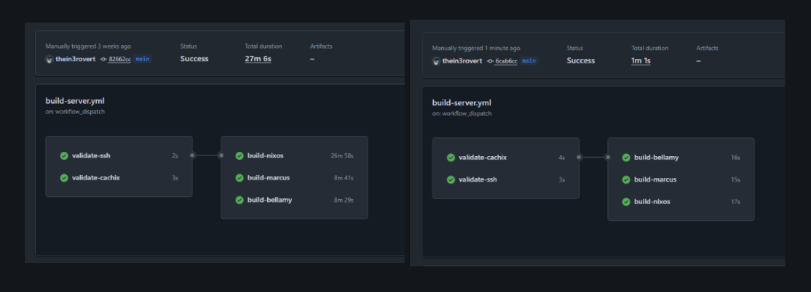

I wrote about [building a self-hosted Terraform CI pipeline](link-to-previous-post). The main aim of that is to deploy my terraform infrastuture changes automatically on push to default branch, which works pretty well..saves me alot of time. However the main aim for me wasn't just. What I really wanted was to fix the painfully slow feedback loop in my NixOS builds. Using the default github runner provided by github the `ubuntu_latest` my build time takes over Twenty minutes per build and seeing that i am building more than one host, the time taken per host were just not right. Today I'm running the same builds in under a minute.
## GitHub's Hosted Runners

My NixOS configurations were building on GitHub's hosted runners and taking forever. Not just slow, but "go make coffee and hope it finishes" slow. Each build would take around 20 minutes, sometimes stretching past 27 minutes depending on what GitHub decided to give me that day. When you're iterating on infrastructure changes, waiting half an hour to discover a typo means you've lost your flow state twice over.

However, here is the reason, the slowness came from a few places. The fact that the GitHub's runners start fresh every time, so there's no persistent Nix store between builds. Every derivation gets built or downloaded from scratch per build and runs. Then there's the network overhead of pulling from Cachix over the public internet. And finally, the runners themselves aren't particularly fast machines.

I already had the self-hosted runner set up as per my previous blog, it is the same runner i use for my Terraform deployment, sitting on my Proxmox cluster with direct access to my local network. It was time to put it to work on the real problem.

## Moving NixOS Builds to Self-Hosted

The existing runner was already configured with most of what I needed: GitHub Actions, Tailscale for network access, all my host run within my tailnet, this helps to improve security hardening as we all know self hosted runner are not overly secure when we run them with public repo and basic tooling. My nest step was `NIX` itself..since i dont want it to be downloaded during run time each time. I installed it using the Determinate Systems installer, which is what i'd recommend for anyone and it also when is been used widly in workflows:

```bash
curl --proto '=https' --tlsv1.2 -sSf -L https://install.determinate.systems/nix | sh -s -- install
```

This installer is better for CI systems than the official one. It sets up multi-user mode properly and integrates with systemd without requiring manual tweaking.

The next issue was permissions, which i ran into. `Cachix` needs to configure binary caches, which requires the user to be in Nix's trusted users list. The Determinate installer creates a clean config structure with a custom configuration file for user modifications:

```bash
echo "trusted-users = root runner" >> /etc/nix/nix.custom.conf
systemctl restart nix-daemon
systemctl restart actions.runner.thein3rovert-nixos-config.github-runner.service
```

After that, I updated my build workflow to use the self-hosted runner. The changes were minimal since I already had the validation steps in place:

```yaml
build-nixos:
  runs-on: [self-hosted, terraform]
  needs: [validate-ssh, validate-cachix]
  steps:
    - name: Setup SSH
      uses: webfactory/ssh-agent@v0.9.0
      with:
        ssh-private-key: ${{ secrets.SSH_PRIVATE_KEY }}
    - name: Checkout
      uses: actions/checkout@main
      with:
        fetch-depth: 1
    - name: Install Nix
      uses: DeterminateSystems/nix-installer-action@main
    - name: Cachix
      uses: cachix/cachix-action@master
      with:
        authToken: ${{ secrets.CACHIX_AUTH_TOKEN }}
        name: thein3rovert
    - name: Build nixos
      run: nix build --accept-flake-config --print-out-paths .#nixosConfigurations.nixos.config.system.build.toplevel
```

The only change is `runs-on: [self-hosted, terraform]` instead of `runs-on: ubuntu-latest`. One things i also learn is you can use self hosted runner for more than one build and manage them using labels. Everything else stayed the same. I kept the Nix installer action in the workflow even though Nix was already on the runner, since it handles some additional setup and doesn't hurt to run.

## Disk Space Issues

The first attempt failed to running the workflow failed when it starts building the third host `nixos`, the other two host `bellay` and `marcus` were fine... this failed because i had set the runner to a 30GB disk thinking i'd be enough, which sounds reasonable however, nixos host been a very large management sever, it managed every other server so i expect it to have alot of packages and dependencies, so it ran out of space half way through.

```
error: writing to file: No space left on device
error: Cannot build '/nix/store/24rbhg4di3sb33h9phpf0mzb7kzcjr80-nixos-system-nixos-26.05.20260304.80bdc1e.drv'.
```

NixOS builds accumulate a lot of intermediate derivations. Each configuration shares some packages, but they each have their own closure that needs to be built or downloaded. Thirty gigabytes wasn't enough.

I already had the runner defined in Terraform, so fixing this was just updating the disk size:

```hcl
module "github_runner" {
  source = "../../modules/lxc"

  # ... other config ...
  disk_size = "80G"  # was 30G
}
```

A quick `terraform apply` later and the runner had enough space to handle all three configurations with room to spare.

## The Finale..

First build after the disk resize: 6 minutes. Not the 1 minute I was hoping for, but a massive improvement over 20+ minutes and i assume thi is because it needed to cache new derivation from the previous failed builds. Also, the Nix store was being populated from Cachix over my local network instead of the public internet, which helped. The runner also had persistent storage, so anything built stayed around for subsequent runs.

Second build: 1 minute and 30 seconds.

Third build: 1 minute flat.

That's a 20x speedup compared to GitHub's hosted runners. The first build still takes a few minutes because it's populating the local Nix store, but every build after that is essentially instant. The persistent Nix store means most derivations are already present. When something does need to be fetched, it's coming from Cachix over a low-latency local network connection instead of traversing the public internet.

The difference in iteration speed is dramatic. Before, I'd push a change, go do something else, and come back to check if it worked. Now I push and immediately see results.

A lil more on why this works, yea...the speedup comes from a few factors working together. The persistent Nix store is the biggest win. As i mentioned above the github hosted runners start fresh every time, so every package has to be downloaded or built, however this keep everything around between builds, so only changed derivations need work.

Local network access matters more than I expected. Cachix is fast, but there's still latency involved in pulling packages over the internet... in this case my runner sits on the same network as my infrastructure, so when it does need to fetch something, it's happening at LAN speeds.

Running on my own hardware means I control the resources. The LXC container has 2 cores and 4GB of RAM, which isn't a lot, but it's consistently available. GitHub's runners vary in performance depending on what you get assigned. Consistency helps with predictable build times.

## What's Actually Running

I'm building three NixOS configurations in parallel: my main desktop (nixos), a server (marcus), and another machine (bellamy). Each build job runs independently on the same runner:

```yaml
strategy:
  matrix:
    config:
      - nixos
      - marcus
      - bellamy
```

This matrix strategy means all three builds kick off simultaneously. Since they share most of their dependencies through the Nix store, the second and third builds benefit from whatever the first one already fetched. The whole workflow completes in whatever time the longest individual build takes, which is consistently around 1 minute after the initial cache population.

## The Cost of Self-Hosting my own runner

I know i've discussed the benefit and pros, but one thing i personally believe is every good thing has a downside or costs, there are tradeoffs to running your own infrastructure. The runner needs maintenance. When something breaks, I'm the one who has to fix it. Compare to  GitHub's hosted runners that just work, even if they're slow.

Another, NixOS builds are large, and you need to plan for that. Eighty gigabytes feels like overkill for a CI runner, but it's necessary when you're building multiple system configurations and i see my adding more host later on.

Security is one other cons..yea. The runner has network access to my infrastructure and credentials to push to Cachix. It's running on my network behind Tailscale, which helps, but it's still a potential attack surface, comparing that to GitHub hosted runners which are ephemeral and isolated, which is safer by default.

For my use case though, the tradeoffs are worth it.. and i'd spend more time hardening it. The speed improvement is substantial, and I was already running this infrastructure anyway. Adding a CI runner to an existing Proxmox cluster doesn't add much operational overhead.

## Future Improvements

Right now the runner just builds NixOS configurations. The next step is actually deploying them. I could have the runner push builds directly to machines instead of building locally on each host. That would let me deploy to multiple machines simultaneously without each one needing to build independently.

I'm also thinking about adding build artifact caching beyond what Cachix provides. The runner could maintain a local binary cache that's even faster than pulling from Cachix. For frequently rebuilt derivations, that might shave off a few more seconds.

The current setup is good enough though. One minute builds are fast enough. When I push a change, I know immediately if it worked. That's what I was after.

If you're running NixOS and getting frustrated with slow CI builds, setting up a self-hosted runner might be worth the effort. The initial setup takes some time, but the productivity gain is real. Twenty minutes to one minute is `GOAT`...

Thanks for reading...happy learning.
