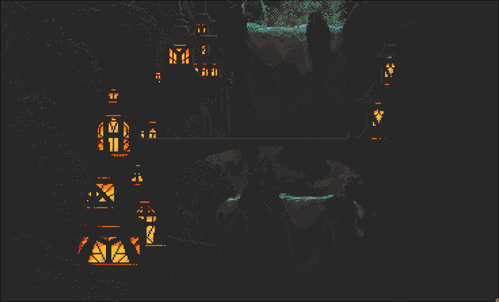

## Background: Discovering Clan at NixCon 2025

Last month, I had the opportunity to attend NixCon 2025 online (unfortunately couldn't make it in person). It was an incredible experience learning about the latest developments in the Nix ecosystem. One of the talks that particularly caught my attention was about **Clan** - a tool for managing NixOS machines declaratively - presented by Qubae and Kenji Berthold.



You can watch their presentation here: [NixCon 2025 - Clan Talk](https://youtu.be/wwOEKMB0HQk?si=H4vFHmxs6ysETMMy)

The talk really resonated with me. I've been managing my homelab infrastructure with NixOS for a while now, using Colmena for deployments, but I was intrigued by Clan's approach to machine management. While I wasn't planning to immediately migrate my entire infrastructure, the idea of being able to explore new tools and potentially improve my setup was too tempting to resist.

Today, I decided to take Clan for a spin - just for tinkering purposes, really. This blog post documents that journey, including the bumps along the way.
## The Original Plan: Testing on Demo
My initial plan was simple: integrate Clan into my `demo` host as a test case. This seemed like the perfect candidate - it's a non-critical machine in my homelab specifically set up for experimentation.

However, reality had other plans. When I went to check on the demo host, I discovered it had been down for months due to an SSD failure I'd forgotten about. That old Kingston drive finally gave up the ghost sometime back, and I hadn't gotten around to replacing it.

So, pivot time.
## Plan B: Meet Octavia

Enter **Octavia** - a new node I recently spun up as a test server. Fresh installation, working hardware, and perfect for experimentation. Octavia would be my guinea pig for Clan integration.
## My Existing Flake Structure

Before diving into Clan, let me show you what my infrastructure looked like. I'm managing 5 NixOS hosts using a flake-based setup with flake-parts:

- `nixos` - My main workstation
- `demo` - Test server (currently deceased)
- `vps-het-1` - Production VPS
- `wellsjaha` - Prod environment
- `octavia` - New Prod server (our hero today)

Here's the relevant part of my original `flake.nix`:

```nix
{
  description = ''
    This is a configuration for managing multiple nixos machines
  '';

  inputs = {
    home-manager = {
      url = "github:nix-community/home-manager";
      inputs.nixpkgs.follows = "nixpkgs";
    };

  outputs = { self, nixpkgs, flake-parts, ... }@inputs:
    flake-parts.lib.mkFlake { inherit inputs; } {
      systems = [ "aarch64-linux" "x86_64-linux" "aarch64-darwin" "x86_64-darwin" ];

      imports = [ ./modules/flake ];

      flake = let
        forAllLinuxHosts = self.inputs.nixpkgs.lib.genAttrs [
          "nixos" "demo" "vps-het-1" "wellsjaha" "octavia"
        ];
      in {
        nixosConfigurations = forAllLinuxHosts (
          host: self.inputs.nixpkgs.lib.nixosSystem {
            specialArgs = { inherit self inputs; };
            modules = [
              ./hosts/${host}
              # ... various modules
            ];
          }
        );

        # Colmena deployment configuration
        colmenaHive = colmena.lib.makeHive {
          # ... deployment configs for all hosts
        };
      };
    };
}
```

This setup worked well. I could deploy using Colmena, rebuild individual machines with `nixos-rebuild`, and everything was nicely organized. But I wanted to see what Clan could bring to the table.

## Adding Clan: The Integration Process

### Step 1: Adding the Clan Input

First, I needed to add `clan-core` as a flake input:

```nix
inputs = {
  # ... existing inputs ...

  clan-core = {
    url = "https://git.clan.lol/clan/clan-core/archive/main.tar.gz";
    inputs.nixpkgs.follows = "nixpkgs";
  };
};
```
### Step 2: Creating the Clan Configuration
The key insight here was that I didn't want to convert all my hosts to Clan immediately - just Octavia for testing. So I created a Clan configuration that only included one machine:

```nix
clan = clan-core.lib.clan {
  self = self;
  specialArgs = {
    inherit self inputs nix-colors colmena nixpkgs-unstable-small;
  };
  meta.name = "octavia-clan-test";

  machines = {
    octavia = {
      nixpkgs.hostPlatform = "x86_64-linux";
      imports = [
        ./hosts/octavia
        # Clan networking configuration
        {
          clan.core.networking.targetHost = "10.20.0.2";
        }
      ];
    };
  };
};
```

### Step 3: Merging Configurations
Here's the clever bit: I kept my existing `nixosConfigurations` for all hosts, then **overrode** just Octavia with the Clan version:

```nix
nixosConfigurations =
  (forAllLinuxHosts (
    host: self.inputs.nixpkgs.lib.nixosSystem {
      # ... regular configuration ...
    }
  ))
  // {
    # Override octavia with Clan configuration
    octavia = clan.config.nixosConfigurations.octavia;
  };

# Expose Clan outputs
inherit (clan.config) clanInternals;
clan = clan.config;
```

This approach meant:
- My other 4 hosts remained completely unchanged
- Octavia got the Clan treatment
- I could still use Colmena for the non-Clan hosts
- Everything coexisted peacefully

### Step 4: Adding the Clan CLI

To interact with Clan, I enabled my development shell and added the CLI:

```nix
devShells = forAllSystems ({ pkgs }: {
  default = pkgs.mkShell {
    packages = [
      # ... existing tools ...
      clan-core.packages.${pkgs.system}.clan-cli
    ];
  };
});
```
## The Bumps in the Road

Of course, it wasn't all smooth sailing. I hit a couple of issues that needed fixing.
### Issue 1: Duplicate Disko Imports
My first attempt included all module imports in the Clan configuration:

```nix
imports = [
  ./hosts/octavia
  agenix.nixosModules.default
  inputs.disko.nixosModules.disko  # ← This was the problem!
  self.nixosModules.users
  # ... etc
];
```

This caused an error:
```
error: The option `_module.args.diskoLib' is defined multiple times
```

The issue? My `./hosts/octavia` configuration already imported disko! I was importing it twice, causing a conflict. The fix was simple - just import the host configuration and let it handle the rest:

```nix
imports = [
  ./hosts/octavia
  {
    clan.core.networking.targetHost = "10.20.0.2";
  }
];
```
### Issue 2: Missing Network Interface
The second issue was more subtle:
```
error: Failed assertions:
- networking.defaultGateway.interface is not optional when using networkd.
```

In my Octavia configuration, I had:
```nix
networking.defaultGateway = "10.20.0.254";
```
But when using systemd-networkd (which Clan expects), you need to specify the interface:

```nix
networking.defaultGateway = {
  address = "10.20.0.254";
  interface = "enp1s0";
};
```

I added this as an override in the Clan configuration for now, but the proper fix is to update the host configuration directly.
## The Final Result
After working through these issues, here's my complete integrated flake:
```nix
{
  description = ''
    This is a configuration for managing multiple nixos machines
  '';

  inputs = {
    home-manager = {
      url = "github:nix-community/home-manager";
      inputs.nixpkgs.follows = "nixpkgs";
    };
    clan-core = {
      url = "https://git.clan.lol/clan/clan-core/archive/main.tar.gz";
      inputs.nixpkgs.follows = "nixpkgs";
    };
  };

  outputs = {
    self,
    home-manager,
    nixpkgs,
    flake-parts,
    nixpkgs-unstable-small,
    clan-core,
    ...
  }@inputs:
    flake-parts.lib.mkFlake { inherit inputs; } {
      systems = [
        "aarch64-linux"
        "x86_64-linux"
        "aarch64-darwin"
        "x86_64-darwin"
      ];

      imports = [ ./modules/flake ];

      flake = let
        inherit (self) outputs;

        allSystems = [
          "aarch64-linux"
          "x86_64-linux"
          "aarch64-darwin"
          "x86_64-darwin"
        ];

        forAllSystems = f:
          self.inputs.nixpkgs.lib.genAttrs allSystems (
            system: f {
              pkgs = import self.inputs.nixpkgs {
                inherit system;
                config.allowUnfree = true;
              };
            }
          );

        forAllLinuxHosts = self.inputs.nixpkgs.lib.genAttrs [
          "nixos"
          "demo"
          "vps-het-1"
          "wellsjaha"
          "octavia"
        ];

        # Clan configuration for Octavia only
        clan = clan-core.lib.clan {
          self = self;
          specialArgs = {
            inherit self inputs nix-colors colmena nixpkgs-unstable-small;
          };
          meta.name = "octavia-clan-test";

          machines = {
            octavia = {
              nixpkgs.hostPlatform = "x86_64-linux";
              imports = [
                ./hosts/octavia
                {
                  clan.core.networking.targetHost = "10.20.0.2";
                }
                {
                  networking.defaultGateway = {
                    address = "10.20.0.254";
                    interface = "enp1s0";
                  };
                }
              ];
            };
          };
        };
      in {
        # NixOS Configurations - regular for most, Clan for Octavia
        nixosConfigurations =
          (forAllLinuxHosts (
            host: self.inputs.nixpkgs.lib.nixosSystem {
              specialArgs = {
                inherit self inputs nix-colors colmena nixpkgs-unstable-small;
              };
              modules = [
                ./hosts/${host}
                self.inputs.home-manager.nixosModules.home-manager
                agenix.nixosModules.default
                inputs.disko.nixosModules.disko
                self.nixosModules.users
                self.nixosModules.nixosOs
                self.nixosModules.hardware
                self.nixosModules.core
                self.nixosModules.containers
                {
                  nixpkgs.overlays = [ self.overlays.default ];
                }
                {
                  environment.systemPackages = [
                    ghostty.packages.x86_64-linux.default
                  ];
                }
                {
                  home-manager = {
                    backupFileExtension = "backup";
                    extraSpecialArgs = { inherit self; };
                    useGlobalPkgs = true;
                    useUserPackages = true;
                  };
                  nixpkgs.config.allowUnfree = true;
                }
              ];
            }
          ))
          // {
            # Override octavia with Clan configuration
            octavia = clan.config.nixosConfigurations.octavia;
          };

        # Expose Clan outputs
        inherit (clan.config) clanInternals;
        clan = clan.config;

        # Development shell with Clan CLI
        devShells = forAllSystems ({ pkgs }: {
          default = pkgs.mkShell {
            packages = (with pkgs; [
              alejandra
              nixd
              nil
              bash-language-server
              shellcheck
              shfmt
              nix-update
              git
              ripgrep
              sd
              fd
              pv
              fzf
              bat
              nmap
              python3
              python3Packages.wcwidth
            ]) ++ [
              self.inputs.agenix.packages.${pkgs.system}.default
              clan-core.packages.${pkgs.system}.clan-cli
            ];
          };
        });

        # NixOS Modules
        nixosModules = {
          users = ./modules/nixos/users;
          nixosOs = ./modules/nixos/os;
          locale-en-uk = ./modules/nixos/locale/en-uk;
          hardware = ./modules/hardware;
          core = ./modules/core;
          containers = ./modules/nixos/containers;
        };
}
```

## Testing It Out
With everything configured, it was time to test:
```bash
# Update flake inputs
nix flake update

# Verify the flake structure
nix flake show

# Enter development shell
nix develop

# List Clan machines
clan machines list
# Output: octavia

# Deploy to Octavia using Clan
clan machines update octavia
```
And it worked! Octavia was now being managed through Clan while my other hosts continued to work normally with their existing setup.
## Reflections and Next Steps
This experiment was exactly what I hoped for - a chance to explore Clan without disrupting my existing infrastructure. Here are my key takeaways:

1. **Incremental adoption is possible** - You can integrate Clan alongside existing tools
2. **Configuration coexistence** - Clan and traditional NixOS configs can live together
3. **Good documentation** - The Clan docs were helpful for troubleshooting

## Resources

- [Clan Documentation](https://docs.clan.lol/)
- [NixCon 2025 Clan Talk](https://youtu.be/wwOEKMB0HQk?si=H4vFHmxs6ysETMMy) by Qubae and Kenji Berthold
- [Clan Core GitHub](https://git.clan.lol/clan/clan-core)
- [Converting Existing NixOS Configurations Guide](https://docs.clan.lol/getting-started/convert/)
