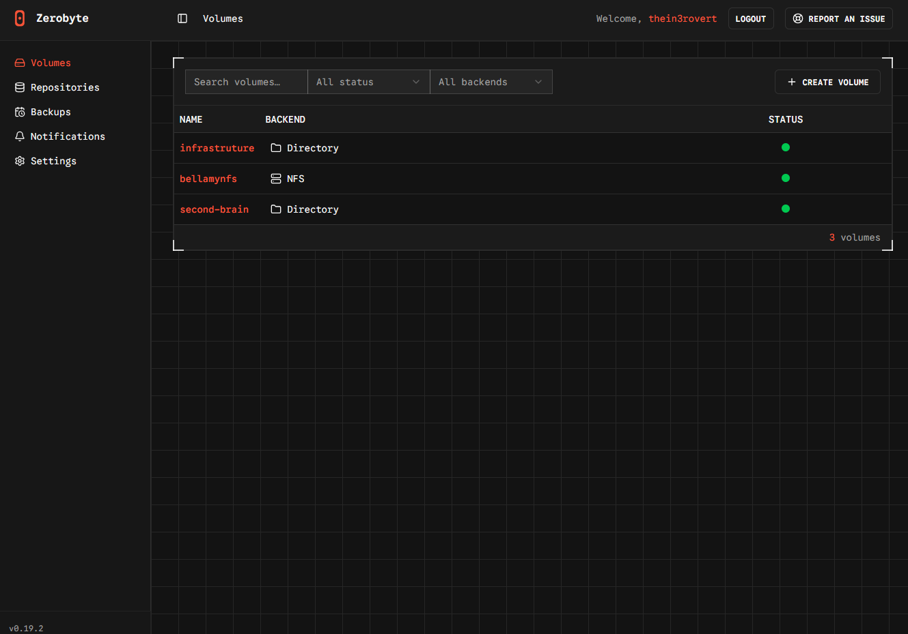
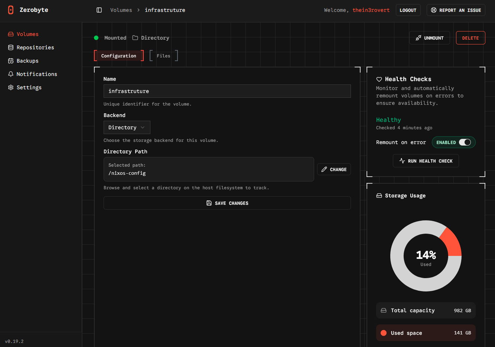
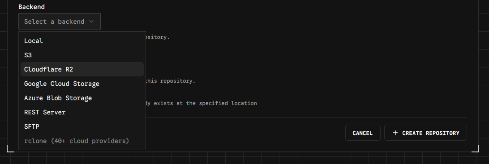
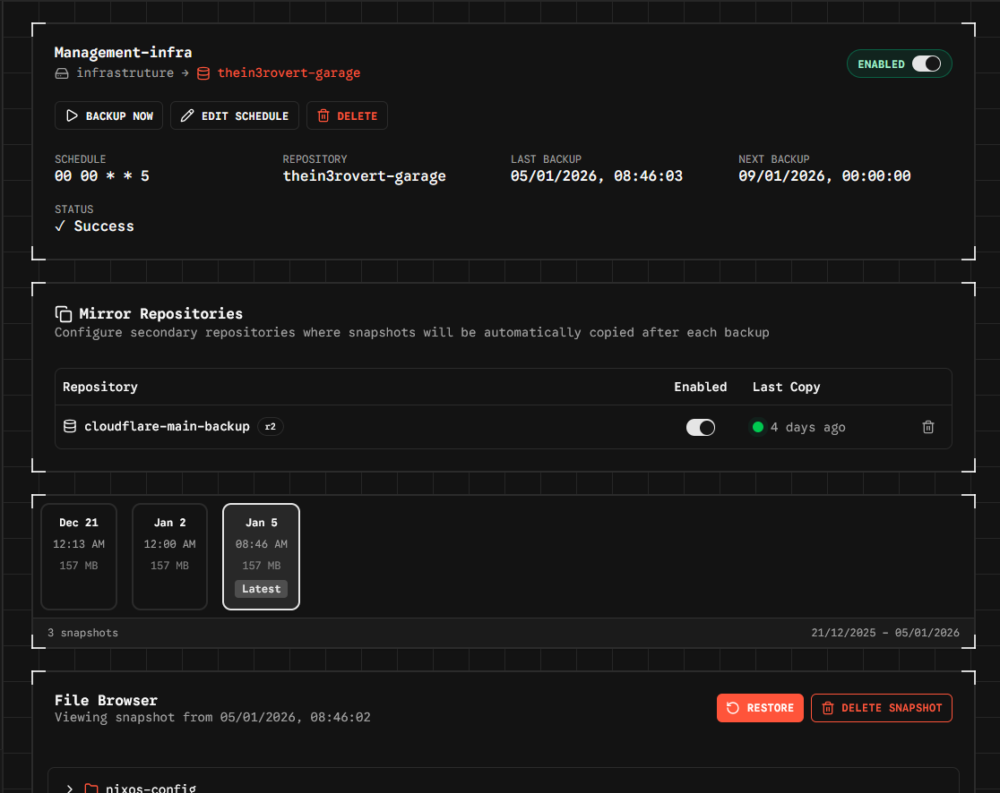
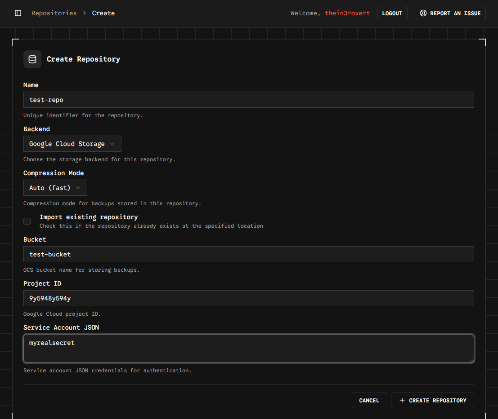
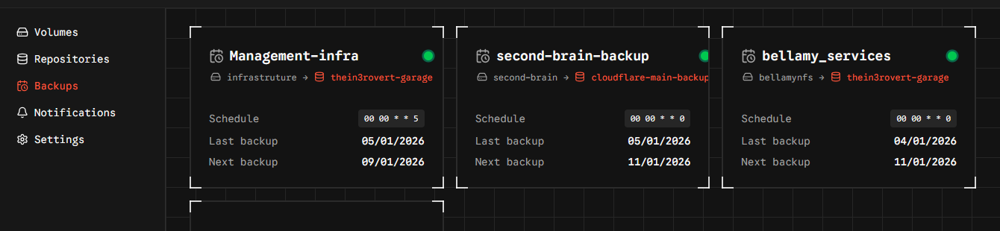
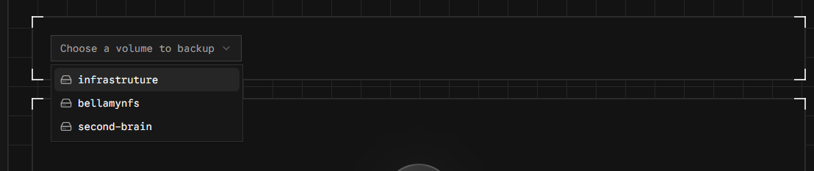
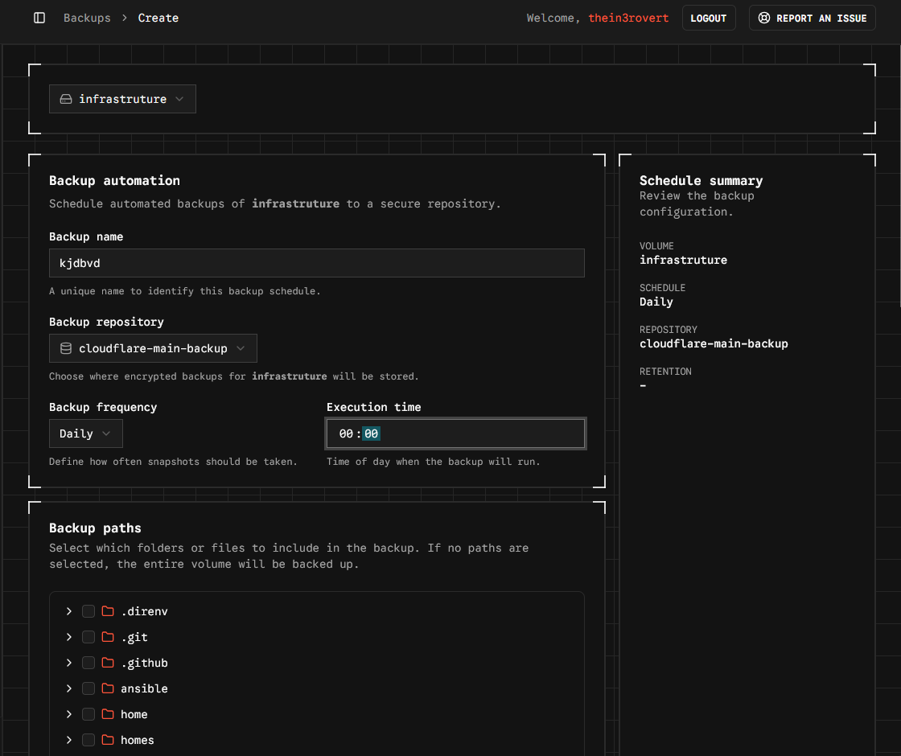
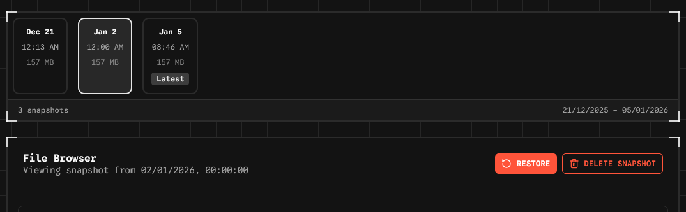
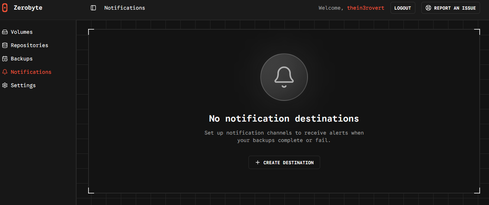

# Learning About Backups the Hard Way

Backups were never really something that I took seriously. I don't know why... maybe it's because I'd never really experienced a system failure before, or maybe because when I did, I eventually didn't end up losing that much data. I just relied on my system as long as it looked clean and things were running pretty well. I assumed that no unfortunate event would cause my laptop to get destroyed or something. That mindset changed pretty quickly.

About six months ago, I had an unfortunate event with my homelab. I got this new mini PC that was just about seven months old at the time. This PC was what I used as my management node... I used it to manage all my other machines and nodes on my servers in my homelab. I never really foresaw my PC having an NVMe failure because I believed it was a new PC. I had a lot of data, a lot of important documents, and a lot of important notes on this PC. I even had my second brain on this PC. My second brain is like my notes folder where I write down things I learn and other things.

On this day, I had just finished updating my system to the latest version, so I decided to go downstairs to get a cup of tea after the long updating and patching process. I didn't know that the latest version of the operating system I was running had a package that wasn't being maintained. The package consumed quite a lot of RAM and memory, and that made my system overload. It was running at one hundred percent while I was busy making my tea downstairs. When I got back to the system, I realized that my system had stopped working. I couldn't move my mouse. I could not do anything on it. I tried to reboot the system and found out that my drive had been burnt due to the overload.

I lost everything. When I say everything, I mean everything. I used that management system to save most of what I know... my documents, my everything. It was devastating. Eventually I got a new NVMe after about two months when I could save up and buy a new one. At that time, I started thinking about backups. Even though I didn't really take backups seriously, I tried as much as possible to back up the most important things to my Google Drive, and to take it seriously enough to enable the backups that I was running on my servers and save them into an S3 bucket.

You'd think I would have learned my lesson by then, right? But I didn't.

Not so long after that, I had another unfortunate problem with my work laptop, which I had just gotten. I thought maybe because it's a new laptop and I haven't really used it for and then it safe. I forgot to back up my notes to Google Drive. I had been taking notes since the start of my placement... I logged everything I did daily. I had a lot of notes and presentations from meetings I'd been to, conferences, conversations, and other important stuff that I kept for work. Unfortunately, I lost all of it when the system crashed. This put me in a really sad place for about a week. At that time, I started to take backups a lot more seriously, and I would say I'��m not Evangelist when it comes to backing up things on the system. I always make sure that I remind my friends... have you backed up your system? Have you backed up your phone? Have you backed up your backup? Have you backed up yourself? And stuff like that. So in order not all? I'm just going to work to my current you back up the most important thing on my system Currently, I only use two tools for backing up things on my system. The first one is Ansible, and the second one is Restic.

Ansible is a widely used infrastructure tool called IaC. It's mainly useful for managing multiple servers at once and can also be used for infrastructure automation and infrastructure deployment, and other cool stuff. However in this post we will not be talking about my ansible backup but my zerobyte backup because it's easier to selfhost and easy to use, this cannot be used in an actual production setting, it's best suitable for homelab use case.

In order to run Zerobyte, you need to have Docker and Docker Compose installed on your server. Then, you can use the provided docker-compose.yml file to start the application.

```
services:
  zerobyte:
    image: ghcr.io/nicotsx/zerobyte:v0.21
    container_name: zerobyte
    restart: unless-stopped
    cap_add:
      - SYS_ADMIN
    ports:
      - "4096:4096"
    devices:
      - /dev/fuse:/dev/fuse
    environment:
      - TZ=Europe/Paris # Set your timezone here
    volumes:
      - /etc/localtime:/etc/localtime:ro
      - /var/lib/zerobyte:/var/lib/zerobyte
```

Do not run Zerobyte on a server that is accessible from the Internet. If you want to do so, make sure you have a VPS or change your port to something non-standard and use a secure SSH tunnel... something like Cloudflare or Tailscale.

Also, do not try to point this specific volume to a network share because if you do, you'll face permission issues and strong performance degradation.

After running the command to start Zerobyte, you can visit the web UI on the specified port and you should get a minimal interface like this:


As you can see, the interface contains five main sections... the volume section, the repository section, the backup section, notification section, and the settings section.

The volume section represents the source data that you want to backup. The repository represents where you want your encrypted backup to be stored. And the backup section is where you create your actual backup jobs once you already have your volume and repository configured. The backup is the main important part of the application.

Zerobyte also offers a few backends that we can use for our repository... S3 bucket, Cloudflare R2 (which is what I use for my permanent backup), Google Cloud Storage, Azure Blob Storage, REST Server, SFTP, and local storage.

One very interesting thing I love about Zerobyte is the ability to create snapshots. Zerobyte automatically helps you create snapshots of your backup. So in case you lose your data or if you need to restore your data from two weeks ago, you can basically just restore from the snapshots.

To add a volume, navigate to the Volumes section in the web interface and click Create volume. You'll need to fill in the volume name, volume type (SMB, NFS, WebDAV, Directory, etc.), and connection settings like credentials and paths. For local directories, you'll need to mount them into the ZeroByte container first by adding a volume mapping in your docker-compose.yml, then select Directory as the volume type in the web interface.

For creating repositories, navigate to the Repositories section, click Create repository, select the backend type (Local, S3, REST, rclone, etc.), and configure your connection settings.

Once you have your volumes and repositories set up, you can create backup jobs.

Navigate to the Backups section and click Create backup job. You'll configure which volume to back up, which repository to store it in, set your schedule (daily, weekly, etc.), specify which files or directories to include, and set your retention policy... like keeping the last 10 snapshots, 5 dailies, 3 weeklies, and 2 monthlies. You can also set exclude patterns for specific files you don't want backed up.




Backup jobs will run automatically according to your schedule, but you can also trigger manual backups using the Backup Now button.

When you need to restore data, just navigate to the Backups section, select the backup job, choose a snapshot, browse the files and select what to restore, choose your restore location (original location or custom), and configure any restore options like overwrite mode.

ZeroByte makes it easy to restore individual files or entire directories from any snapshot.

So that's a simple walkthrough on how to back up your files and data. If you've been postponing this, now is the time to back up your life.

Zerobyte is very easy to use because of its simple minimalist web interface and structure. One last thing worth mentioning... Zerobyte also includes notifications.

Notifications are important but not necessary. You can use them to confirm or verify if your backup has been completed or if your backup failed. It sends an alert to either your Discord or your Slack channel. I haven't set up notifications on mine yet, but I plan to do that this week.

So that's all about this blog post. If you enjoyed it, thank you so much for reading. Have a good day and don't forget to back up.
