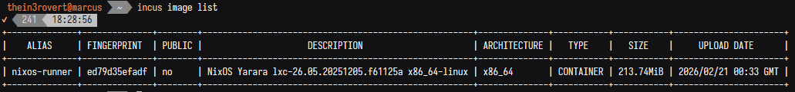

A few days ago I set up my own Git instance, Forgejo. As a certified tinkerer, it was about time I explored that space, but mainly because I wanted to set up my own custom runner for my workflows, and also because I thought it would be fun to figure out. Beyond that, running my own runner means I have full control over the build environment without relying on third-party services.

I've also been experimenting with Incus as my virtualization method, and I thought... hmmm, it would be cool to run my custom runner on a minimal Incus LXC container. That's when I decided to create a minimal NixOS LXC image that I could spin up quickly whenever I needed a new runner. I didn't want the bloat that comes with minimal ISOs, so I decided to build my own custom image with exactly what I needed from the start.

## Creating the Flake Structure

Before we build an image, we need to think about a few things..why we want the image, what it'll be used for, how small it should be. In my case, I wanted an image to serve as a custom runner for my Forgejo instance.

The entry point for managing a NixOS system is the `flake.nix`, so we need a few inputs to get started.

```
inputs = {
    nixpkgs.url = "github:nixos/nixpkgs?ref=nixos-unstable";
    colmena.url = "github:zhaofengli/colmena";
    disko = {
      url = "github:nix-community/disko";
      inputs.nixpkgs.follows = "nixpkgs";
    };
    nixos-generators = {
      url = "github:nix-community/nixos-generators";
      inputs.nixpkgs.follows = "nixpkgs";
    };
  };
```

The `nixpkgs` input is the main NixOS package repository containing all packages and NixOS modules. `disko` handles declarative disk partitioning and formatting right from the Nix config. `nixos-generators` lets us generate different image formats like LXC, ISO, or VM images from a NixOS configuration. `colmena` is what I'll use later to deploy NixOS configs to remote servers.

Then we need to add the NixOS configuration that takes in the configuration to be applied to the image. This configuration lives in `configuration.nix`. I won't include the full config here since it's quite long, but there's a link to the repo at the end if you want to make your own.

The NixOS configuration uses nixos-generators to build a bootable LXC container image (rootfs plus metadata) from your `configuration.nix`, which can then be imported into Incus.

```
  packages.x86_64-linux = {
	lxc = nixos-generators.nixosGenerate {
	  system = "x86_64-linux";
	  pkgs = nixpkgs.legacyPackages.x86_64-linux;
	  modules = [
		./configuration.nix
	  ];
	  format = "lxc";
	};
	lxc-meta = nixos-generators.nixosGenerate {
	  system = "x86_64-linux";
	  pkgs = nixpkgs.legacyPackages.x86_64-linux;
	  modules = [ ./configuration.nix ];
	  format = "lxc-metadata";
	};
  };
```

The config is reusable, so make sure to check the repo...just copy the `flake.nix` and `configuration.nix`, and make sure to change the `hostname` and `username`.

```
  nixosConfigurations.<HOSTNAME:CHANGE ME> = nixpkgs.lib.nixosSystem {
	system = "x86_64-linux";
	modules = [
	  disko.nixosModules.disko
	  ./configuration.nix
	];
  };
```

```
  users.users.<USERNAME:CHANGE ME> = {
    isNormalUser = true;
    extraGroups = [
      "networkmanager"
      "wheel"
    ];
    openssh.authorizedKeys.keys = [ "ENTER-SSH-KEY" ];
  };
```

## Building the Image

Now we build the image with `nix build .#lxc`.

After that, we send the image over to the server and run the incus command to add the image to the Incus images list. Incus doesn't support NixOS images built with nixos-generator directly, which was frustrating to figure out.

```
 thein3rovert@marcus  ~/images/nixos  incus image import nixos-image-lxc-proxmox-26.05.20251205.f61125a-x86_64-linux.tar.xz  nixos-image-lxc-26.05.20251205.f61125a-x86_64-linux.tar.xz --alias nixos-runner           ✔  102  00:12:29
Error: Metadata tarball is missing metadata.yaml
 thein3rovert@marcus  ~/images/nixos 
```

I think I figured out the issue. I was using the nixos-generator `proxmox-lxc` format instead of just the plain `lxc` format, so the format was wrong. The issue I likely hit before was using `proxmox-lxc` format alone that generates a Proxmox-specific tarball without the `metadata.yaml` that Incus requires. The `lxc-metadata` format generates exactly that metadata tarball.

We need to create separate folders for both the metadata and the LXC image since they have the same name.

```
 thein3rovert@marcus  ~/images/nixos  ls
result-meta
 thein3rovert@marcus  ~/images/nixos  mkdir result-lxc
 thein3rovert@marcus  ~/images/nixos  ls
result-lxc  result-meta
```

The command to import into Incus is: metadata comes first, then the image second.

```
incus image import \
  result-meta/*.tar.xz \
  result-lxc/*.tar.xz \
  --alias nixos-runner
```

Done, the image has been imported.

```
 thein3rovert@marcus  ~/images/nixos  incus image import \
   result-meta/*.tar.xz \
   result-lxc/*.tar.xz \
   --alias nixos-runner
Image imported with fingerprint: ed79d35efadf77f2fdf046ed4b76a9692cf160c3efc12a2b9494e2d2689e55a6
```

Now let me verify with `incus image list`.

Here below is a pretty minimal image that will serve my needs and many more to come.

```
incus image list
```

```
ALIAS         FINGERPRINT    PUBLIC  DESCRIPTION                                     ARCHITECTURE  TYPE       SIZE      UPLOAD DATE
nixos-runner  ed79d35efadf  no      NixOS Yarara lxc-26.05.20251205.f61125a       x86_64        CONTAINER  213.74MiB  2026/02/21
```

Now let's launch a new LXC with the added image.

```
incus launch nixos-runner nixos-runner
```

And there we go...it works like it's supposed to. Now my aim is to use Nix as my own custom CI/CD runner.

## Managing Deployment with Colmena

I had a bit of a problem after the creation. When I entered the created nixos-runner container, I was unable to connect to it or ping it from my main management server where I planned to manage it. Here's how the flow works...I have my main server (NixOS) and then have another server (NixOS on Marcus) on the same network at 10.10.10.x. Then on Marcus, I have Incus running nixos-lxc. But Incus wasn't getting the IP from Marcus, which was supposed to be 10.10.10.x. Instead, it gets a different one that only Marcus can connect to and not my main NixOS.

To solve this, I had to use something called SSH `proxy-jump`. ProxyJump means SSH through an intermediate server to reach a destination that isn't directly accessible. My main server can't reach 10.127.42.183 directly (it's a private network on Marcus), so it SSHs into Marcus first, then Marcus SSHs into the container on your behalf. To you, it feels like one direct connection.

One issue with the image I built is that the hostname I set for the image when I built it didn't happen to apply on the image after it was built, so I guess I'd have to figure out why that is. Other settings applied, but only the hostname didn't.

Apart from that, everything else looks fine. Now the next step is to apply new config using colmena. In my flake.nix, I added a new colmena deployment.

```
	# ---- Node: Runner [ lxc 02 ] ----
	nixos-runner = {
	  deployment = {
		targetHost = "nixos-runner";
		targetPort = 22;
		targetUser = "thein3rovert";
		buildOnTarget = true;
		tags = [
		  "prod"
		  "runner"
		];
	  };
	  nixpkgs.system = "x86_64-linux";
	  imports = [
		./hosts/runner
		agenix.nixosModules.default
		self.nixosModules.users
		self.nixosModules.containers
		self.nixosModules.nixosOs
		self.nixosModules.snippets
	  ];
	};
```

Upon applying my new config, I ran into a sandboxing issue. I think I've had this issue before on a previous day while I was building an image for Proxmox.

Sandboxing isolates each build in its own restricted environment so it can't access the internet or files outside its declared dependencies, ensuring reproducible builds. LXC containers don't have the kernel namespaces required to create that isolation, hence the error.

To disable that, I added the config `nix.setting.sandbox = false`. But my build was still failing, so I needed to do it manually. NixOS being a read-only system...I can't edit the `/etc/nix/nix.conf` so I had to edit the nix config in the root dir instead before my build successfully applied.

```
mkdir -p /root/.config/nix
echo "sandbox = false" >> /root/.config/nix/nix.conf
```

Yay, welcome me nixos-runner
